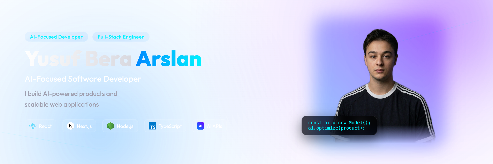

  
  
    
  
  

 

  

 

  

  

  

 

  

 

  

  

  
  

 

  <h3 style="color: #fff; font-family: 'Outfit', sans-serif;">Let's Build Together 🤝</h3>
  
Looking to join an <b>AI-first company</b> or collaborate on exciting new ideas.

   
  
  &nbsp;&nbsp;
  
  &nbsp;&nbsp;
  
  &nbsp;&nbsp;
  

