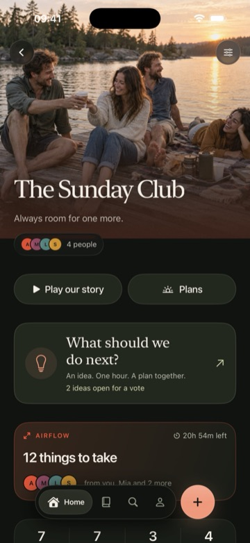
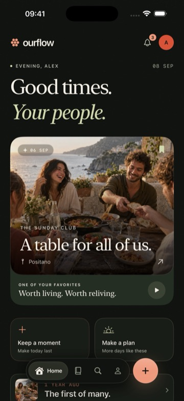
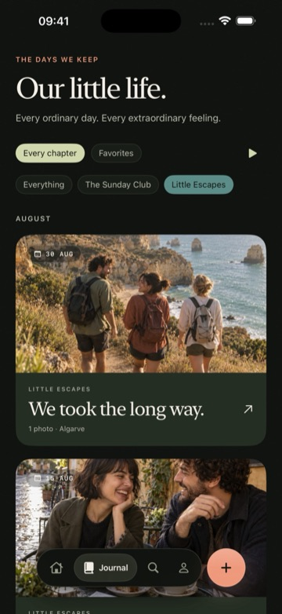
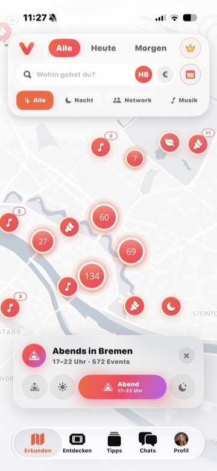
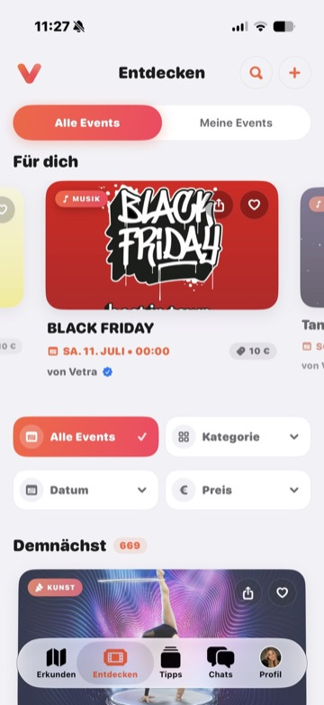
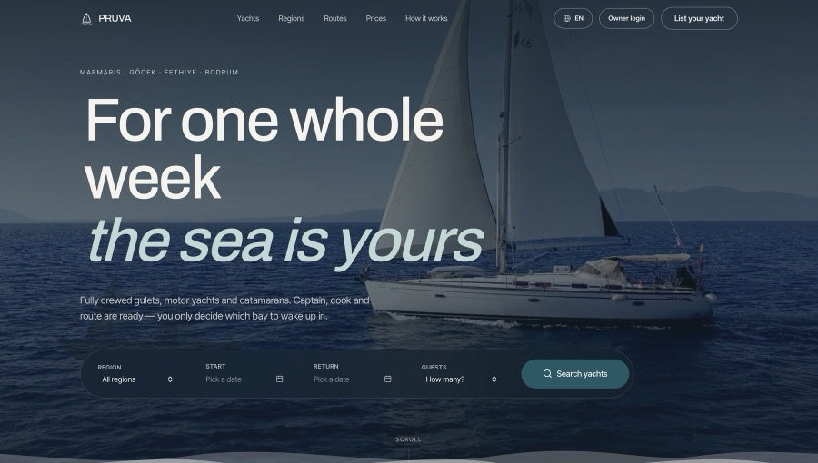
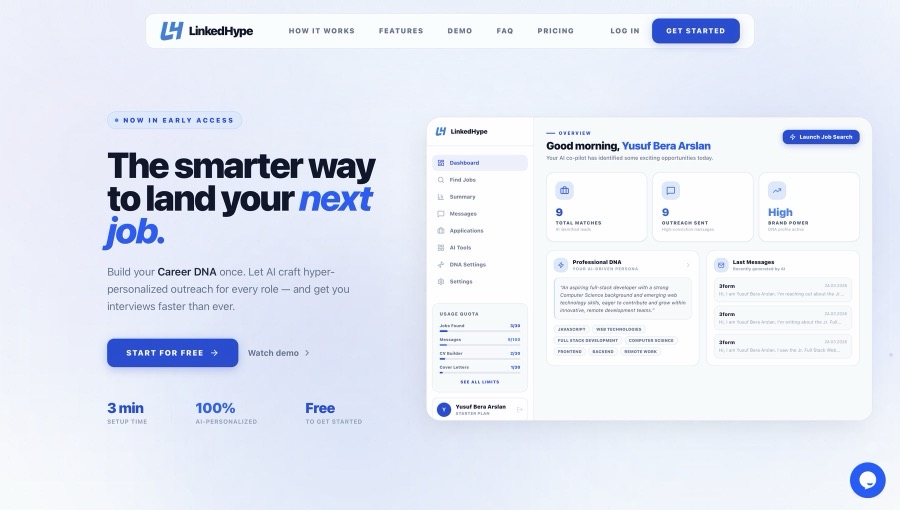
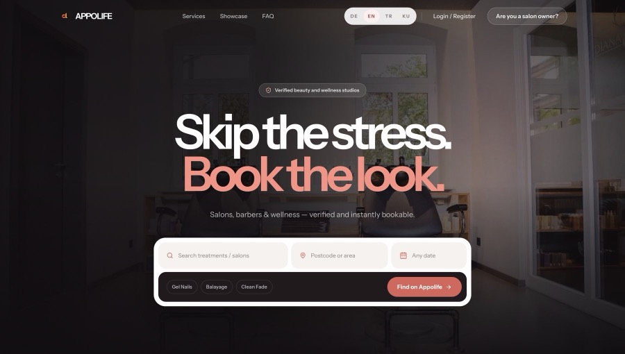

<a href="https://yusufbera.de">
  <picture>
    <source media="(prefers-color-scheme: dark)" srcset="assets/banner-dark.svg">
    
  </picture>
</a>

  
  
  
  

 

I'm Bera, an independent engineer and founder in Bremen. I like taking a small idea seriously enough to turn it into a whole product: the interface, the native app, the backend, the launch.

Claude Code and Codex are part of how I build. I set the direction, shape the architecture, then review and refine the code. The responsibility for what ships stays with me.

- 🌱 &nbsp;Studying **B.Sc. Computer Science** at the University of Bremen
- 🛠️ &nbsp;Six products founded and engineered solo since 2023
- 📱 &nbsp;One live iOS app on the App Store, and one in development
- 🤝 &nbsp;Open to **full-time, working student and internship roles** in Germany

 

##  &nbsp;Right now: OurFlow

**A private home for your people and the days you share.**
The trips, the dinners, the ordinary Fridays. OurFlow brings a group's memories, photos and next plans into one private space. It's the product I'm putting most of my energy into.

<table>
  <tr>
    <td align="center" width="33%"></td>
    <td align="center" width="33%"></td>
    <td align="center" width="33%"></td>
  </tr>
  <tr>
    <td valign="top"><b>A space for each crew</b> Private groups bring shared photos, videos and memories together. A journal keeps the days easy to find again.</td>
    <td valign="top"><b>From an idea to a plan</b> Suggest something, let your people vote, and turn it into a plan with a date, a place and the details that matter.</td>
    <td valign="top"><b>Pass the good parts on</b> AirFlow gives the group a temporary space to swap photos and videos. Keep the favorites before they expire.</td>
  </tr>
</table>

> I own the product direction, interface, native **SwiftUI** app, **Firebase** backend and the companion website.
> The website is live at [ourflow.app](https://ourflow.app). The iOS app is still in development.

 

## 📱 Vetra, live on the App Store

<table>
  <tr>
    <td width="50%" valign="middle">
      <b>Find your people. Make a plan.</b>  
      A social event discovery app I built and shipped end to end, from the native iOS experience to the backend and the App Store release.  
      ✓ &nbsp;Shipped solo: iOS app, backend and release 
      ✓ &nbsp;Cleared several Apple review rejections (EULA and Terms linking, Guideline 5.1.1(v), IAP) 
      ✓ &nbsp;Wrote and submitted my own Resolution Center responses  
      <a href="https://apps.apple.com/de/app/vetra-discover-events/id6772997447"><b>View on the App Store →</b></a>
    </td>
    <td width="50%" align="center">
      
      
    </td>
  </tr>
</table>

 

## 🧭 Also built

<table>
  <tr>
    <td width="33%" valign="top">
      
       <b>Pruva</b> &nbsp;Pre-launch
       A marketplace for renting boats for vacation trips. Reviewable at <a href="https://pruva.appolife.com">pruva.appolife.com</a>.
    </td>
    <td width="33%" valign="top">
      
       <b>LinkedHype</b> &nbsp;Complete
       AI job matching and outreach, with a reverse recruitment marketplace model and an AI interview architecture.
    </td>
    <td width="33%" valign="top">
      
       <b>Appolife</b> &nbsp;Handed off
       Multi-tenant salon and barbershop booking SaaS for the German market. Built the core system solo, then handed it off.
    </td>
  </tr>
</table>

| Project | What it is | Role |
| :-- | :-- | :-- |
| **Cairn** | An AI-native personal knowledge app for iOS | Founder & developer, 2026 |
| **Get4Trip** | Copy and content refresh for a travel and transport booking platform | Content update, 2 months, 2026 |
| **Freelance** | Websites and web apps for small businesses, e.g. Next.js + Supabase + Stripe Checkout on Vercel | Independent contractor, since 2023 |

 

## 🧰 Toolbox

  

  
  
  
  
  

 

## ✍️ How I work

**Find the real problem.** Start with what someone needs to do. Shape the experience and the architecture around that, then make the first useful version.

**Build the whole thing.** Interface, backend, payments, deployment. I direct AI coding tools, review their output and connect the pieces into a working product.

**Care after it ships.** App Store reviews, unexpected bugs, the details you only notice in use. I stay with the product and keep making it better.

 

## 🎓 Profile

<table>
  <tr>
    <td valign="top" width="50%">
      <b>Education</b> 
      B.Sc. Computer Science (Informatik), German-taught 
      University of Bremen, 2026 to present 
      Studienkolleg completed beforehand
    </td>
    <td valign="top" width="50%">
      <b>Languages</b> 
      🇹🇷 Turkish, native 
      🇩🇪 German, C1 (telc C1 Hochschule) 
      🇬🇧 English, professional
    </td>
  </tr>
</table>

 

  <b>Something in mind? Let's make it real.</b> 
  Open to full-time, working student and internship roles in Germany, alongside my studies. Freelance and product conversations welcome too.  
  <a href="mailto:contact@yusufbera.de">contact@yusufbera.de</a> &nbsp;·&nbsp; <a href="https://yusufbera.de">yusufbera.de</a> &nbsp;·&nbsp; <a href="https://instagram.com/yusufbera.dev">Instagram</a>

